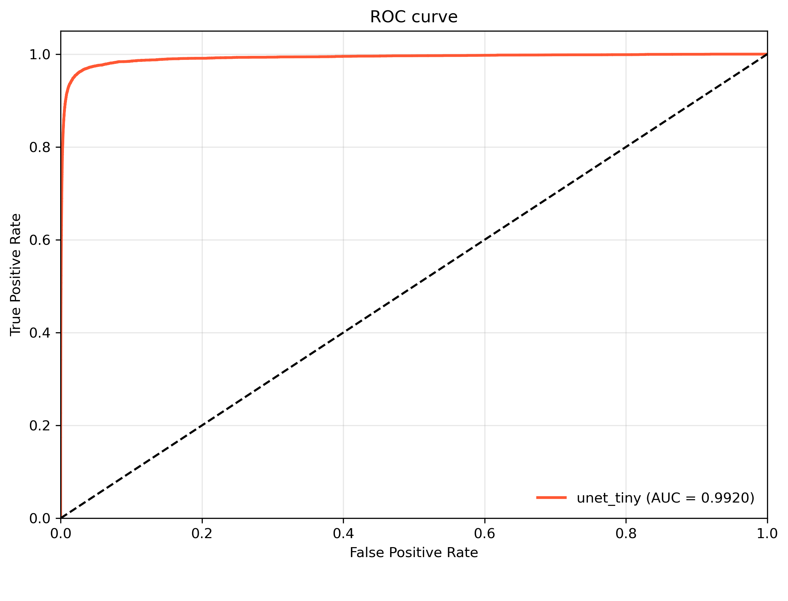
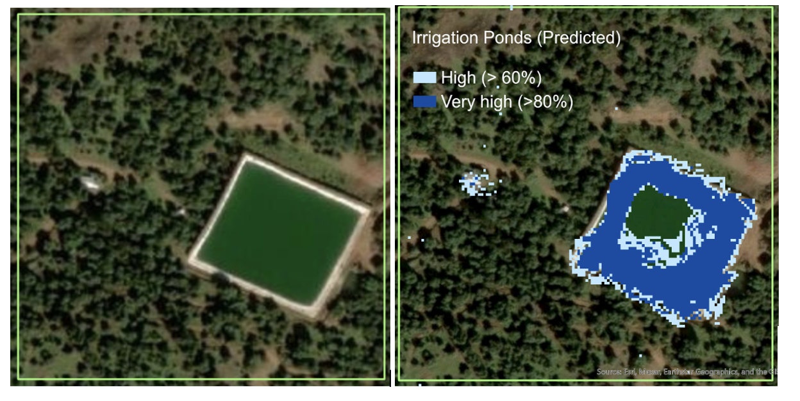

# mlgis-ponds

Deep learning pipeline for detecting irrigation ponds in satellite imagery. This toolkit was developed for my PhD dissertation studying how international trade affects agricultural investment and development in Mexico.

## Motivation

Irrigation infrastructure, especially for cash crop agriculture, is a key form of agricultural capital investment, yet little systematic data exists on their spatial distribution, especially over the long-run. This project uses convolutional neural networks to detect ponds in satellite imagery, enabling the construction of panel datasets that track agricultural intensification through private investment at fine geographic scales. As of December 4, 2025, the published codebase generates a dataset covering the 2019-2024 period based on Sentinel-2 imagery. Over the following weeks, a more complete version will be released which also uses Landsat-5, Landsat-7, Landsat-8, and Harmonized Landsat-Sentinel (HLS) to extend the dataset to the 1985-2024 period.

## Pipeline

1. **Data Download** (`01_downloads_gee_sentinel2.py`) - Export annual composites from Google Earth Engine
2. **Preprocessing** (`02_preproc.py`) - Cloud masking, tiling, and TFRecord creation
3. **Training** (`03_main.py`) - U-Net model training and evaluation

## Project Structure

```
mlgis-ponds/
├── config/
│   ├── config.yaml       # Paths and hyperparameters
│   └── mlgis.yaml        # Conda environment
├── src/
│   ├── 01_downloads_gee_sentinel2.py
│   ├── 02_preproc.py
│   ├── 03_main.py
│   └── mlgis_helpers/
│       ├── cfg.py
│       ├── data_loading.py
│       ├── evaluation.py
│       ├── model.py
│       ├── preprocess_tfrecord.py
│       └── training.py
└── assets/
    ├── detection_example.png
    └── roc_curve_S2.png
```

## Results

The model achieves strong out-of-sample performance (AUC = 0.99) on held-out validation tiles. The figure below is based on 2024 Sentinel-2 imagery, but similar results can be obtained with 2019 or 2021 imagery.

<p align="center">
  
</p>

Example detection in Michoacan, Mexico. Left: Maxar imagery (0.5 meter resolution, much finer than Sentinel-2) showing an irrigation pond surrounded by avocado orchards. Right: Model predictions with confidence levels.

<p align="center">
  
</p>

## Setup

Create the `mlgis` conda environment:

```bash
conda env create -f config/mlgis.yaml
conda activate mlgis
```

## Usage

**Step 1: Data Download** Run `01_downloads_gee_sentinel2.py`. This will fetch all Setninel-2 images (L2A) that Google Earth Engine has for the state of Michoacan in Mexico, for a year of your choice (my dissertation uses 2019-2024). Each year weighs around 90GB, and this will be stored in your Google Drive. The script could be set up to instead use Google Cloud, which is faster, but it would carry a monetary cost every time you run the script and/or download the imagery.

Moving 90GB from Google Drive to your local file system is non-trivial and doing so manually will often require multiple failed attempts. I recommend using `rclone`, which has a convenient CLI. To set it up:

```bash
rclone config delete SebastianGmailGdrive
rclone config
```

Then:
1. `n` - new remote
2. Name: `NAMEOFYOURCHOICE` # e.g., I use `SebastianGmailGdrive`
3. Type: `20` (Google Drive)
4. client_id: Enter (empty)
5. client_secret: Enter (empty)
6. scope: `1` (full access)
7. service_account_file: Enter (empty)
8. advanced config: `n`
9. web browser auth: `y`
10. Browser opens - log in and authorize
11. Shared Drive: `n`
12. Confirm: `y`
13. `q` to quit

Then rclone is properly configured and you can run (replacing `SebastianGmailGdrive` with the name you chose to assign to your Google Drive for `rclone` operations in step 2 above, replacing `2024` with the appropriate year if you are using a different once, and replacing `YOURDIR` with the location where you want to store raw images):

`rclone copy SebastianGmailGdrive:GoogleEarthEngine_MexMichoacan_S2_2024 /YOURDIR/raw/2024-S2_new/ -P`

On a reasonably fast internet connection `rclone` should transfer each year of imagery in 10-30 minutes.

**Step 2: Preprocessing** GEE's raw imagery, at `/YOURDIR/raw/{year}-S2_new/` are converted into the preprocessed images the ML pipeline expects and saved to `/YOURDIR/raw/{year}-S2_new/`, for any `year` of your choice in 2019-2024

**Step 3 (main): Training**  We train a convolutional neural network (U-NET) that can detect irrigation ponds using `/YOURDIR/proc/{year}-S2_new/`, and the labels in this repo's `labels` folder. To do so, use:

```bash
conda activate mlgis
python src/03_main.py --task pondsNIR-S2024
```

This uses the `pondsNIR-S2024` configuration, training the U-NET on the visible green, near infrared (NIR), and SWIR bands of 2024 Sentinel-2 imagery. The hyperparameter attached to this configuration (e.g., a relatively small U-NET, called `unet_tiny` in the configuration files) performs better than anything else I have tried (a *large* comparison set, including random forests, much larger U-NETs, (possibly pretrained) Residual Networkts, and even a simple visual transfromer. If you discover a better configuration please let me know!

## License

MIT License. See [LICENSE](LICENSE) for details.

## Citation

If you use this code, please cite:

> Sardon, Sebastian (2025). "Trade, Land Consolidation, and Agricultural Productivity." Working Paper, Northwestern University.
